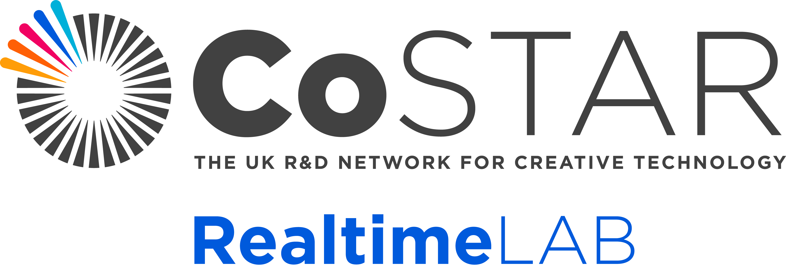

# RealtimeLabICVFX
ICVFX configuration plugin for the CoSTAR Realtime Lab.

## Dependencies
Engine plugins:
- LiveLink
- LiveLinkHub
- nDisplay

Third-party plugins:
- MoSysVPFree ([Download on Fab](https://www.fab.com/listings/4b0ddb44-8d3d-4eb4-8009-9da580f54b38))
- CanonLiveLinkPlugin ([Download from Canon](https://www.canon-europe.com/support/consumer/products/camcorders/cinema-eos/eos-c400.html?type=download&detailId=tcm:13-2389615&os=windows%2011&language=en&productTcmUri=tcm:13-2387148))
- [Optional] NVIDIA DLSS ([Download from NVIDIA](https://developer.nvidia.com/rtx/dlss?sortBy=developer_learning_library%2Fsort%2Ffeatured%3Adesc%2Ctitle%3Aasc#section-getting-started))
